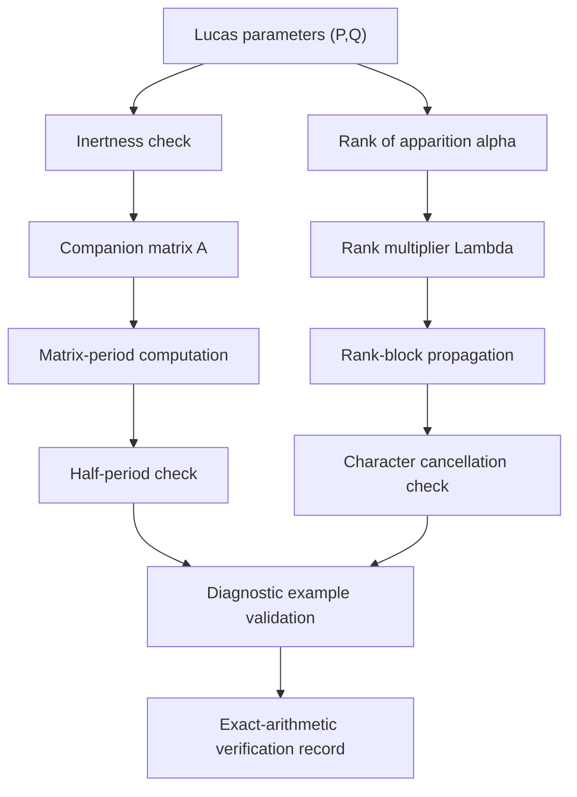

# Half-Period Involutions and Exact Cancellation in Inert Lucas Sequences

[](LICENSE)

> Preprint and reproducibility materials for **“Half-Period Involutions and Exact Cancellation in Inert Lucas Sequences.”**

This repository accompanies a focused structural note on Lucas recurrences modulo inert primes. The manuscript studies the half-period scalar involution of the companion matrix and organizes two exact mechanisms that can force cancellation of full-period character sums.

**Majid Ghandali** · Independent Researcher · Tehran, Iran · 2026  
[ORCID: 0009-0001-1097-1770](https://orcid.org/0009-0001-1097-1770)

**Release status:** first archival release preparation.  
**Repository DOI:** pending Zenodo archival release.

---

## Important Scope Statement

The accompanying manuscript contains the mathematical statements, proofs, hypotheses, and literature positioning.

This repository provides the manuscript source, compiled preprint, diagnostic computational checks, and release/provenance materials associated with the manuscript.

> [!IMPORTANT]
> The mathematical proofs are contained in the manuscript. The computations in this repository verify selected diagnostic examples and implementation details; they do **not** replace the proofs.

> [!IMPORTANT]
> The classical rank–period–multiplier framework used by the manuscript is explicitly attributed to the existing literature. This repository does not claim a new general theory or classification of Lucas ranks, periods, or multipliers.

---

## Why This Repository?

The accompanying manuscript considers the Lucas sequence

```text
U_0 = 0
U_1 = 1
U_(n+2) = P U_(n+1) - Q U_n
````

and its companion sequence

```text
V_0 = 2
V_1 = P
V_(n+2) = P V_(n+1) - Q V_n
```

For an odd prime `p` with `p ∤ Q`, the discriminant is

```text
D = P^2 - 4Q
```

The inert setting is

```text
chi_p(D) = -1
```

The companion matrix is

```text
A = [[P, -Q],
     [1,   0]]
```

over `F_p`.

The manuscript studies two exact structural mechanisms:

1. half-period translation arising from a scalar matrix involution;
2. scalar propagation between consecutive rank blocks.

---

## Repository at a Glance

| Item                  | Value                                                  |
| :-------------------- | :----------------------------------------------------- |
| Mathematics           | Lucas recurrences modulo inert primes                  |
| Main objects          | `U_n(P,Q)`, `V_n(P,Q)`, companion matrix `A`           |
| Structural mechanisms | Half-period translation; rank-block scalar propagation |
| Computational role    | Diagnostic exact-arithmetic verification               |
| Manuscript source     | `manuscript/`                                          |
| Verification code     | `code/`                                                |
| Verification outputs  | `results/`                                             |
| Release metadata      | `metadata/`                                            |
| License               | MIT                                                    |
| Archival DOI          | Pending first Zenodo release                           |

---

## Quick Navigation

| Action                                  | Link                                                                    |
| :-------------------------------------- | :---------------------------------------------------------------------- |
| Read the main structural setting        | [Main Structural Setting](#main-structural-setting)                     |
| Inspect the two cancellation mechanisms | [Two Exact Cancellation Mechanisms](#two-exact-cancellation-mechanisms) |
| Inspect diagnostic examples             | [Diagnostic Examples](#diagnostic-examples)                             |
| Review the mathematical scope           | [Mathematical Scope](#mathematical-scope)                               |
| Review the theoretical framework        | [Theoretical Framework](#theoretical-framework)                         |
| Run the verifier                        | [Reproducibility](#reproducibility)                                     |
| Build the preprint                      | [Build the Preprint](#build-the-preprint)                               |
| Inspect repository structure            | [Repository Structure](#repository-structure)                           |
| Inspect release provenance              | [Provenance and Integrity](#provenance-and-integrity)                   |
| Cite the repository                     | [Citation](#citation)                                                   |
| Check Zenodo status                     | [Zenodo Archival Release](#zenodo-archival-release)                     |

---

## Contents

* [Main Structural Setting](#main-structural-setting)
* [Two Exact Cancellation Mechanisms](#two-exact-cancellation-mechanisms)
* [Diagnostic Examples](#diagnostic-examples)
* [Mathematical Scope](#mathematical-scope)
* [Theoretical Framework](#theoretical-framework)
* [Verification Pipeline](#verification-pipeline)
* [Reproducibility Principles](#reproducibility-principles)
* [Installation](#installation)
* [Usage](#usage)
* [Build the Preprint](#build-the-preprint)
* [Repository Structure](#repository-structure)
* [Provenance and Integrity](#provenance-and-integrity)
* [Citation](#citation)
* [Zenodo Archival Release](#zenodo-archival-release)
* [Release Discipline](#release-discipline)
* [License](#license)
* [Author](#author)

---

## Main Structural Setting

Let

```text
A = [[P, -Q],
     [1,  0]]
```

be the companion matrix modulo `p`, and let

```text
T = ord_GL2(F_p)(A)
```

denote its matrix period.

In the inert setting, the manuscript records the exact half-period criterion

```text
A^m = -I  (mod p)

if and only if

T is even and m = T/2  (mod T).
```

Thus, when `T` is even,

```text
A^(T/2) = -I  (mod p)
```

and consequently

```text
U_(n + T/2) = -U_n  (mod p)
V_(n + T/2) = -V_n  (mod p).
```

This yields exact cancellation for functions satisfying

```text
f(-x) = -f(x).
```

For the quadratic character, this mechanism applies in particular when

```text
chi_p(-1) = -1.
```

---

## Two Exact Cancellation Mechanisms

### 1. Half-Period Translation

If the matrix period `T` is even,

```text
U_(n + T/2) = -U_n  (mod p)
V_(n + T/2) = -V_n  (mod p).
```

Hence every odd function on `F_p` cancels under pairing over a complete matrix period.

For the quadratic character `chi_p`, the relevant condition is

```text
chi_p(-1) = -1.
```

Equivalently,

```text
p = 3  (mod 4).
```

---

### 2. Rank-Block Scalar Propagation

Let

```text
alpha = rank of apparition of p
```

and define the rank multiplier

```text
Lambda = U_(alpha + 1)  (mod p).
```

The classical rank–period–multiplier framework gives

```text
A^alpha = Lambda I  (mod p).
```

Therefore,

```text
U_(r + t alpha) = Lambda^t U_r  (mod p)
V_(r + t alpha) = Lambda^t V_r  (mod p).
```

Let

```text
omega = ord_Fp(Lambda)
T = alpha omega.
```

For a multiplicative character `psi`, extended by `psi(0) = 0`,

```text
sum_(n=1)^T psi(U_n)
=
(sum_(t=0)^(omega-1) psi(Lambda)^t)
(sum_(r=1)^alpha psi(U_r)),
```

and similarly for `V_n`.

Thus,

```text
psi(Lambda) != 1
```

forces exact full-period cancellation.

> [!NOTE]
> The rank–period–multiplier framework and the underlying classical Lucas identities are explicitly attributed in the accompanying manuscript. This repository does not present them as newly discovered theory.

---

## Diagnostic Examples

The repository includes exact-arithmetic verification of diagnostic examples from the manuscript.

| Example                 | Parameters                 | Structural role                                     |
| :---------------------- | :------------------------- | :-------------------------------------------------- |
| Fibonacci modulo 7      | `P = 1`, `Q = -1`, `p = 7` | Half-period quadratic cancellation                  |
| Scalar example modulo 5 | `P = 1`, `Q = 2`, `p = 5`  | Rank-block scalar cancellation when `chi_p(-1) = 1` |

For

```text
(P, Q, p) = (1, 2, 5)
```

one has

```text
alpha = 6
Lambda = U_7 = 2  (mod 5)
chi_5(Lambda) = -1
chi_5(-1) = 1
```

Thus the full-period quadratic character sums vanish through scalar rank-block propagation rather than through half-period odd-function pairing.

The repository verifier checks the corresponding finite identities using exact modular arithmetic.

---

## Mathematical Scope

The manuscript works with general Lucas parameters `(P,Q)` under the inert hypothesis

```text
p is an odd prime
p does not divide Q
chi_p(P^2 - 4Q) = -1
```

The repository does not claim:

* a new general theory of Lucas ranks, periods, or multipliers;
* a new classification of rank multipliers;
* a density theorem;
* a Chebotarev theorem;
* an Artin-type distribution theorem;
* a solution of unresolved parity or density problems.

The manuscript remains the authoritative source for the exact mathematical scope, theorem statements, proofs, and literature positioning.

---

## Theoretical Framework

The repository accompanies a manuscript whose structural framework can be summarized as follows:

```text
Inert Lucas recurrence
        |
        v
Companion matrix over F_p
        |
        v
Matrix period T
        |
        +------------------------------+
        |                              |
        v                              v
Half-period involution          Rank multiplier
A^(T/2) = -I                    A^alpha = Lambda I
        |                              |
        v                              v
Anti-periodicity                Rank-block propagation
        |                              |
        +---------------+--------------+
                        |
                        v
              Exact character cancellation
```

The supporting literature includes classical Lucas work and modern treatments of period, rank, entry-point, and order phenomena, together with the cited literature on character sums for recurrence sequences.

For complete hypotheses, proofs, and bibliographic context, consult the accompanying manuscript.

---

## Verification Pipeline

The repository verification is intentionally subordinate to the mathematics of the manuscript.



The verification pipeline checks the explicitly stated examples and structural identities selected for reproducibility.

It does not replace the mathematical proofs or establish new mathematical results.

---

## Reproducibility Principles

1. **Exact arithmetic**

   Mathematical checks use exact modular arithmetic.

2. **Proof/computation separation**

   The manuscript contains the proofs; the repository checks selected finite instances.

3. **Traceable provenance**

   Release artifacts are associated with manifests and SHA-256 hashes.

4. **No hidden research state**

   Private research paths, failed exploratory scripts, credentials, local temporary files, and internal governance records are not included in the public repository.

5. **Versioned archival release**

   Public releases identify immutable tagged source snapshots.

---

## Installation

Requirements:

* a Python environment compatible with the repository requirements;
* packages listed in `code/requirements.txt`, if present.

Install the declared dependencies:

```bash
pip install -r code/requirements.txt
```

The exact dependency versions and execution environment used for the recorded diagnostic verification are documented in the release artifacts.

> [!NOTE]
> For exact archival reproducibility, check out the corresponding Git tag before installing and executing the verification code.

---

## Usage

From the repository root:

```bash
python code/verify_examples.py
```

A successful run produces:

```text
results/example_verification.json
```

The verification program uses exact modular arithmetic and checks the diagnostic examples described above.

Additional release-specific reproduction commands, if any, are documented in the corresponding release notes and provenance manifest.

---

## Build the Preprint

The manuscript source is located in:

```text
manuscript/
```

A local preprint build may be performed with the source tree and its declared bibliography tools.

For the preprint branch, the standard compilation chain is:

```bash
cd manuscript

pdflatex Main_P4_Preprint.tex
bibtex Main_P4_Preprint
pdflatex Main_P4_Preprint.tex
pdflatex Main_P4_Preprint.tex
```

The compiled preprint PDF is included in the release package when applicable.

> [!NOTE]
> The repository release contains a preprint/reproducibility version. Journal-facing formatting is handled separately in the submission workflow and should not be inferred from the repository preprint.

---

## Repository Structure

```text
half-period-involutions-in-inert-lucas-sequences/
├── README.md
├── LICENSE
├── CITATION.cff
├── zenodo.json
├── manuscript/
│   ├── Main_P4_Preprint.tex
│   ├── references_P4_Preprint.bib
│   ├── Main_P4_Preprint.bbl
│   └── Main_P4_Preprint.pdf
├── code/
│   └── verify_examples.py
├── results/
│   └── example_verification.json
└── metadata/
    ├── RELEASE_MANIFEST.json
    └── SHA256SUMS.txt
```

The exact directory contents at the archival release are authoritative.

---

## Provenance and Integrity

Each archival release records:

```text
Git commit
Git tag
release manifest
SHA256SUMS
```

The release manifest identifies the exact manuscript and reproducibility artifacts associated with that version.

Before the first tagged archival release:

```text
Repository DOI: pending
```

After archival:

```text
Repository DOI: assigned by Zenodo
```

The DOI must identify the specific archived release and must never be replaced by an invented, temporary, or placeholder DOI.

---

## Citation

### Cite the manuscript

Use the manuscript citation supplied in the archived release metadata.

### Cite the repository

After the first archival release, cite the repository through its `CITATION.cff` metadata and the DOI assigned by Zenodo.

> [!IMPORTANT]
> The DOI should not be entered into this README until Zenodo has actually minted and verified the archival DOI.

---

## Zenodo Archival Release

The intended first archival tag is:

```text
v1.0.0-preprint
```

The archival sequence is:

```text
GitHub release
     |
     v
Zenodo archival ingestion
     |
     v
Version-specific DOI
```

Before the first archival release:

```text
Zenodo DOI: pending
```

After the DOI is minted, the release metadata, `CITATION.cff`, `zenodo.json`, and README should be updated consistently in a subsequent controlled metadata release.

---

## Release Discipline

The public repository is a publication and reproducibility artifact.

Do not commit:

* private research paths;
* credentials, tokens, or secrets;
* failed exploratory artifacts;
* internal governance records;
* unverified DOI placeholders;
* manuscript claims that are not supported by the accompanying paper.

Release tags identify immutable public versions.

---

## License

All contents of this repository are released under the [MIT License](LICENSE).

---

## Author

**Majid Ghandali**
Independent Researcher, Tehran, Iran

Email: [majid.ghandali@gmail.com](mailto:majid.ghandali@gmail.com)
ORCID: [0009-0001-1097-1770](https://orcid.org/0009-0001-1097-1770)
