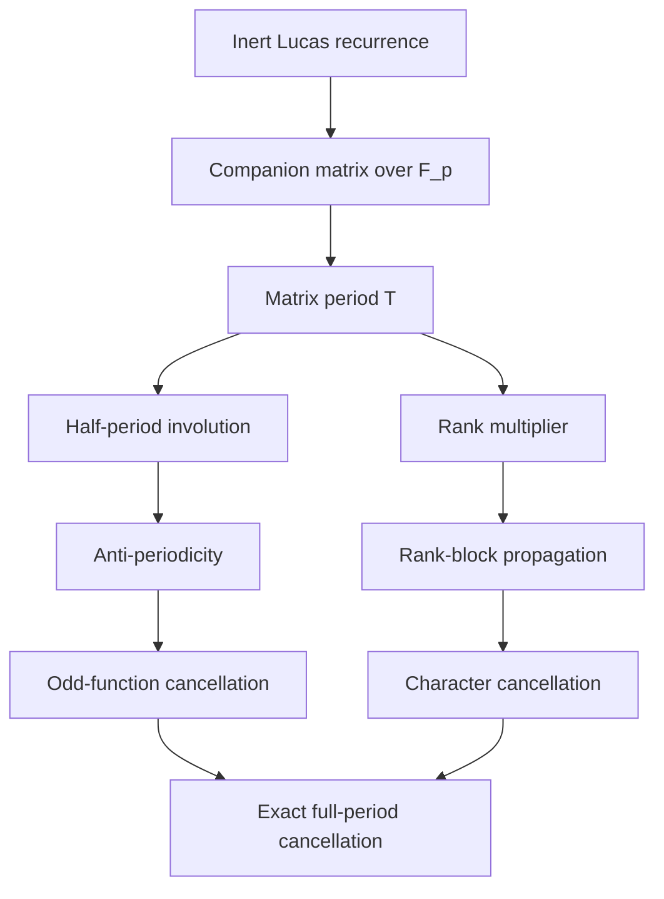
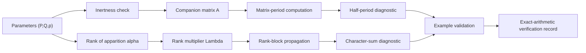

# Half-Period Involutions and Exact Cancellation in Inert Lucas Sequences

[](LICENSE)

> Reproducibility and archival materials for **“Half-Period Involutions and Exact Cancellation in Inert Lucas Sequences.”**

This repository accompanies a focused structural note on Lucas recurrences modulo inert primes. The manuscript studies the half-period scalar involution of the companion matrix and organizes two exact mechanisms that can force cancellation of full-period character sums.

**Majid Ghandali** · Independent Researcher · Tehran, Iran · 2026  
[ORCID: 0009-0001-1097-1770](https://orcid.org/0009-0001-1097-1770)

**Release status:** pending first tagged archival release.  
**Repository DOI:** pending Zenodo archival release.

---

## Important Scope Statement

The accompanying manuscript contains the mathematical statements, hypotheses, proofs, and literature positioning.

This repository provides the manuscript source, compiled preprint, diagnostic computational checks, and release/provenance materials associated with the manuscript.

> [!IMPORTANT]
> The mathematical proofs are contained in the accompanying manuscript. The computations in this repository verify selected diagnostic examples and implementation details; they do **not** replace the proofs.

> [!IMPORTANT]
> The classical rank--period--multiplier framework used by the manuscript is explicitly attributed to the existing literature. This repository does not claim a new general theory or classification of Lucas ranks, periods, or multipliers.

---

## Why This Repository?

The accompanying manuscript considers the Lucas sequence

$$
U_0=0,\qquad
U_1=1,\qquad
U_{n+2}=P U_{n+1}-Q U_n,
$$

and its companion sequence

$$
V_0=2,\qquad
V_1=P,\qquad
V_{n+2}=P V_{n+1}-Q V_n.
$$

For an odd prime $p$ with $p\nmid Q$, the discriminant is

$$
D=P^2-4Q.
$$

The inert setting is

$$
\chi_p(D)=-1.
$$

The companion matrix is

$$
A=
\begin{pmatrix}
P & -Q \\
1 & 0
\end{pmatrix}
\in\mathrm{GL}_2(\mathbb{F}_p).
$$

The manuscript studies two exact structural mechanisms:

1. **half-period translation** arising from a scalar matrix involution;
2. **scalar propagation across rank blocks**.

---

## Repository at a Glance

| Item | Value |
|:--|:--|
| Mathematics | Lucas recurrences modulo inert primes |
| Main objects | $U_n(P,Q)$, $V_n(P,Q)$, companion matrix $A$ |
| Structural mechanisms | Half-period translation; rank-block scalar propagation |
| Computational role | Diagnostic exact-arithmetic verification |
| Manuscript source | `manuscript/` |
| Verification code | `code/` |
| Verification outputs | `results/` |
| Release metadata | `CITATION.cff`; `.zenodo.json` |
| License | MIT |
| Archival DOI | Pending first Zenodo release |

---

## Quick Navigation

| Action | Link |
|:--|:--|
| Main structural setting | [Main Structural Setting](#main-structural-setting) |
| Cancellation mechanisms | [Two Exact Cancellation Mechanisms](#two-exact-cancellation-mechanisms) |
| Diagnostic examples | [Diagnostic Examples](#diagnostic-examples) |
| Mathematical scope | [Mathematical Scope](#mathematical-scope) |
| Verification pipeline | [Verification Pipeline](#verification-pipeline) |
| Build the preprint | [Build the Preprint](#build-the-preprint) |
| Repository structure | [Repository Structure](#repository-structure) |
| Provenance and archival release | [Provenance and Archival Release](#provenance-and-archival-release) |
| Citation | [Citation](#citation) |
| Zenodo release | [Zenodo Archival Release](#zenodo-archival-release) |

---

## Contents

- [Main Structural Setting](#main-structural-setting)
- [Two Exact Cancellation Mechanisms](#two-exact-cancellation-mechanisms)
- [Diagnostic Examples](#diagnostic-examples)
- [Mathematical Scope](#mathematical-scope)
- [Theoretical Framework](#theoretical-framework)
- [Verification Pipeline](#verification-pipeline)
- [Reproducibility Principles](#reproducibility-principles)
- [Usage](#usage)
- [Build the Preprint](#build-the-preprint)
- [Repository Structure](#repository-structure)
- [Provenance and Archival Release](#provenance-and-archival-release)
- [Citation](#citation)
- [Zenodo Archival Release](#zenodo-archival-release)
- [Release Discipline](#release-discipline)
- [License](#license)
- [Author](#author)

---

## Main Structural Setting

Let

$$
A =
\begin{pmatrix}
P & -Q \\
1 & 0
\end{pmatrix}
$$

be the companion matrix modulo $p$, and let

$$
T=\mathrm{ord}_{\mathrm{GL}_2(\mathbb{F}_p)}(A)
$$

denote its matrix period.

In the inert setting, the manuscript records the exact half-period criterion

$$
A^m\equiv -I\pmod p
$$

if and only if

$$
T\text{ is even}
\qquad\text{and}\qquad
m\equiv \frac{T}{2}\pmod T.
$$

Consequently, when $T$ is even,

$$
A^{T/2}\equiv -I\pmod p,
$$

and therefore

$$
U_{n+T/2}\equiv -U_n\pmod p,
\qquad
V_{n+T/2}\equiv -V_n\pmod p.
$$

This yields exact cancellation for functions satisfying

$$
f(-x)=-f(x).
$$

For the quadratic character, this mechanism applies in particular when

$$
\chi_p(-1)=-1,
$$

equivalently when

$$
p\equiv 3\pmod 4.
$$

---

## Two Exact Cancellation Mechanisms

### 1. Half-Period Translation

If the matrix period $T$ is even,

$$
U_{n+T/2}\equiv -U_n\pmod p,
\qquad
V_{n+T/2}\equiv -V_n\pmod p.
$$

Hence every odd function on $\mathbb{F}_p$ cancels under pairing over a complete matrix period.

For the quadratic character $\chi_p$, the relevant condition is

$$
\chi_p(-1)=-1,
$$

equivalently,

$$
p\equiv 3\pmod 4.
$$

### 2. Rank-Block Scalar Propagation

Let

$$
\alpha = \min\{ n \ge 1 : U_n \equiv 0 \pmod p \}
$$

be the rank of apparition, and define the rank multiplier

$$
\Lambda := U_{\alpha+1} \pmod p.
$$

The classical rank--period--multiplier framework gives

$$
A^\alpha \equiv \Lambda I \pmod p.
$$

Consequently,

$$
U_{r+t\alpha} \equiv \Lambda^t U_r \pmod p,
\qquad
V_{r+t\alpha} \equiv \Lambda^t V_r \pmod p.
$$

Let

$$
\omega = \mathrm{ord}_{\mathbb{F}_p^\times}(\Lambda),
\qquad
T = \alpha\omega.
$$

For a multiplicative character $\psi$, extended by $\psi(0)=0$,

$$
\sum_{n=1}^{T} \psi(U_n)=\left(\sum_{t=0}^{\omega-1} \psi(\Lambda)^t\right)\left(\sum_{r=1}^{\alpha} \psi(U_r)\right),
$$

and similarly for $V_n$.

Thus,

$$
\psi(\Lambda) \ne 1
$$

forces exact full-period cancellation.

> [!NOTE]
> The rank--period--multiplier framework and the underlying classical Lucas identities are explicitly attributed in the accompanying manuscript. This repository does not present them as newly discovered theory.

---

## Diagnostic Examples

The repository includes exact-arithmetic verification of diagnostic examples from the manuscript.

| Example | Parameters | Structural role |
|:--|:--|:--|
| Fibonacci modulo $7$ | $(P=1,\ Q=-1,\ p=7)$ | Half-period quadratic cancellation |
| Scalar example modulo $5$ | $(P=1,\ Q=2,\ p=5)$ | Rank-block scalar cancellation with $\chi_p(-1)=1$ |

For

$$
(P,Q,p)=(1,2,5),
$$

one has

$$
\alpha=6,
\qquad
\Lambda=U_7\equiv 2\pmod 5,
$$

and therefore

$$
\chi_5(\Lambda)=-1,
\qquad
\chi_5(-1)=1.
$$

Thus the full-period quadratic-character cancellation in this example is not explained by half-period odd-function pairing; it arises from scalar propagation between successive rank blocks.

The repository verifier checks the corresponding finite identities using exact modular arithmetic.

---

## Mathematical Scope

The manuscript works with general Lucas parameters $P,Q$ under the inert hypothesis

$$
p\text{ odd},
\qquad
p\nmid Q,
\qquad
\chi_p(P^2-4Q)=-1.
$$

The repository does **not** claim:

- a new general theory of Lucas ranks, periods, or multipliers;
- a new classification of rank multipliers;
- a density theorem;
- a Chebotarev theorem;
- an Artin-type distribution theorem;
- a solution of unresolved parity or density problems.

The manuscript remains the authoritative source for the exact mathematical scope, theorem statements, proofs, and literature positioning.

---

## Theoretical Framework

The structural framework can be summarized as follows:



The supporting literature includes classical Lucas work and modern treatments of period, rank, entry-point, and order phenomena, together with the cited literature on character sums for recurrence sequences.

For complete hypotheses, proofs, and bibliographic context, consult the accompanying manuscript.

---

## Verification Pipeline

The repository verification is intentionally subordinate to the mathematics of the manuscript.



Two pure-Python verifiers are provided:

1. **`code/verify-examples.py`** — statement-by-statement verification of the two diagnostic examples in the manuscript (both mechanisms).
2. **`code/verify-theorem-pipeline.py`** — constructive finite verification path for the specialized branch $Q\equiv -1\pmod{p}$ (Mechanism 1 only).

The theorem-pipeline verifier does not replace the mathematical proofs or establish new mathematical results. It explicitly checks both $A^{T/2}=-I$ and $A^T=I$, so that the field-derived order of $\lambda$ is independently confirmed to be the matrix period of $A$.

---

## Reproducibility Principles

1. **Exact arithmetic**  
   Mathematical checks use exact modular arithmetic.

2. **Proof/computation separation**  
   The manuscript contains the proofs; the repository checks selected finite instances.

3. **No hidden research state**  
   Private research paths, credentials, temporary files, failed exploratory scripts, and internal governance records are not included in the public repository.

4. **Versioned archival release**  
   Public releases identify immutable tagged source snapshots.

---

## Usage

The repository verifiers have no third-party Python dependency.

From the repository root, run:

```bash
python code/verify-examples.py
python code/verify-theorem-pipeline.py
```

A successful run creates:

```text
results/example-verification.json
results/theorem-pipeline-verification.csv
results/theorem-pipeline-verification.json
```

The programs use exact modular arithmetic and check the diagnostic examples and the specialized half-period pipeline described above.

---

## Build the Preprint

The manuscript source is located in:

```text
manuscript/
```

For a conventional local build:

```bash
cd manuscript

pdflatex main-p4.tex
bibtex main-p4
pdflatex main-p4.tex
pdflatex main-p4.tex
```

The compiled preprint PDF is included in the release package.

> [!NOTE]
> The repository release contains a preprint/reproducibility version. Journal-facing formatting is maintained separately in the submission workflow and should not be inferred from the repository preprint.

---

## Repository Structure

```text
half-period-involutions-in-inert-lucas-sequences/
│
├── .gitignore
├── .zenodo.json
├── CITATION.cff
├── LICENSE
├── README.md
│
├── manuscript/
│   ├── main-p4.tex
│   ├── main-p4.pdf
│   └── references.bib
│
├── code/
│   ├── verify-examples.py
│   └── verify-theorem-pipeline.py
│
└── results/
    ├── example-verification.json
    ├── theorem-pipeline-verification.csv
    └── theorem-pipeline-verification.json
```

> [!NOTE]
> The exact directory contents at the archival release are authoritative. The tree above is the intended public-release structure and must be reconciled with the actual branch contents before tagging.

---

## Provenance and Archival Release

Each archival release is identified by its Git commit and release tag.  
The Zenodo archive provides the persistent archival record for the tagged release.

Before the first tagged archival release:

```text
Repository DOI: pending
```

After archival:

```text
Repository DOI: assigned by Zenodo
```

The DOI must identify the specific archived release and must not be entered into this README until Zenodo has actually minted and verified it.

---

## Citation

### Cite the manuscript

Use the manuscript citation supplied in the archived release metadata.

### Cite the repository

After the first archival release, cite the repository through its `CITATION.cff` metadata and the DOI assigned by Zenodo.

> [!IMPORTANT]
> The DOI should not be entered into this README until Zenodo has actually minted and verified the archival DOI.

---

## Zenodo Archival Release

The intended first archival tag is:

```text
v1.0.0-preprint
```

The archival sequence is:

```text
GitHub release
      |
      v
Zenodo archival ingestion
      |
      v
Version-specific DOI
```

Before the first archival release:

```text
Zenodo DOI: pending
```

After the DOI is minted, the release metadata, `CITATION.cff`, `.zenodo.json`, and README should be updated consistently in a subsequent controlled metadata release.

---

## Release Discipline

The public repository is a publication and reproducibility artifact.

Do not commit:

- private research paths;
- credentials, tokens, or secrets;
- failed exploratory artifacts;
- internal governance records;
- unverified DOI placeholders;
- manuscript claims that are not supported by the accompanying paper.

Release tags identify immutable public versions.

---

## License

All contents of this repository are released under the [MIT License](LICENSE).

---

## Author

**Majid Ghandali**  
Independent Researcher, Tehran, Iran

Email: [majid.ghandali@gmail.com](mailto:majid.ghandali@gmail.com)  
ORCID: [0009-0001-1097-1770](https://orcid.org/0009-0001-1097-1770)
